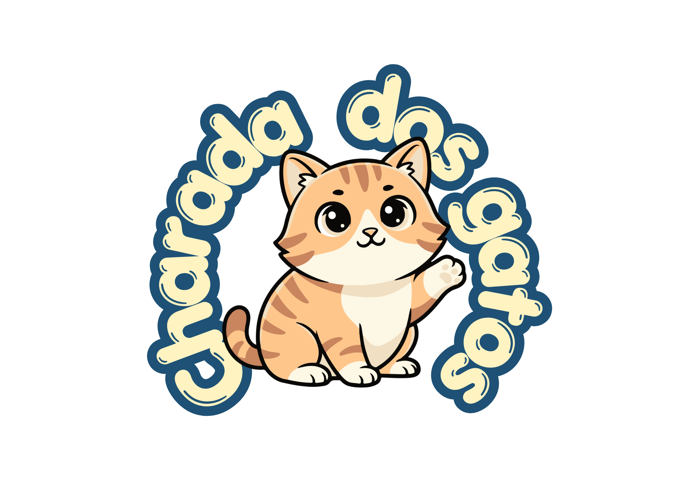

# Projeto-Meow

Desafio da <b><i>"Charada dos Gatos"</b></i>. 

São 3 desafios, cada desafio vencido revela um número de uma senha.  

<b>O primeiro desafio:</b> Encontrar a distância correta no sensor. 

<b>O segundo desafio:</b> Acertar o buraco correto com laser. 

<b>O terceiro desafio:</b> Fazer a sequência correta de movimentos.

 

A senhar abre o cofre que revela stickers de <b>gatos reais</b> que estão aguardando adoção! 

### Um desafio surpreendente! ✨

---

## 🌸 Sobre o projeto

O projeto foi feito para uma atividade da cadeira de SISTEMAS DIGITAIS do curso de ADS.

A ideia surgiu do desejo de fazer um projeto fofo e divertido - com um tema que fosse realmente importante para as participantes do grupo.

Foi bem rápido chegar até a ideia GATOS, e a partir daí pensar em desafios e uma forma de causar um impacto real com esse projeto. 

Resolvemos fazer um jogo para divulgar gatinhos que estão disponíveis para adoção através do perfil @xxxxxxx!

> 💡 **Objetivo:**  
> Criar um projeto em arduíno 

---

## 🎮 Como funciona?

[Explique brevemente como funciona o jogo/projeto e o que o usuário precisa fazer.]

  
  

---

## 🛠️ Equipamentos e tecnologias
🔗  [Protótipo TINKERCAD](https://www.tinkercad.com/things/1wG0w3the4c-projeto-rawr) 

| Equipamento / Tecnologia | Utilização |
|---|---|
| Arduino | [Para que foi usado] |
| [Componente] | [Para que foi usado] |
| [Componente] | [Para que foi usado] |
| [Software] | [Para que foi usado] |

---

## 🐾 Conheça os gatinhos

[Pequena introdução sobre os gatos disponíveis para adoção.]

<table>
<tr>
<td align="center">
   
  <b>🐱 Nome</b> 
  [Informação curtinha]
</td>

<td align="center">
   
  <b>🐱 Nome</b> 
  [Informação curtinha]
</td>

<td align="center">
   
  <b>🐱 Nome</b> 
  [Informação curtinha]
</td>
</tr>
</table>

---

## 💗 Sobre a iniciativa de adoção

[Apresente aqui o local/projeto/ONG que o trabalho buscou divulgar.]

📍 **Local:** [Nome]  
🐾 **Instagram/Site:** [Link]  
💌 **Contato:** [Contato]

---

## 📸 Galeria do projeto

  
  

  
  

---

## 👥 Equipe

| Participante | Responsabilidade |
|---|---|
| [Nome] | [Função/contribuição] |
| [Nome] | [Função/contribuição] |
| [Nome] | [Função/contribuição] |
| [Nome] | [Função/contribuição] |

---

### 🐾 Feito com Arduino, criatividade e muitos gatinhos 🐾

[Projeto Meow • CESAR SCHOOL • 2026]

